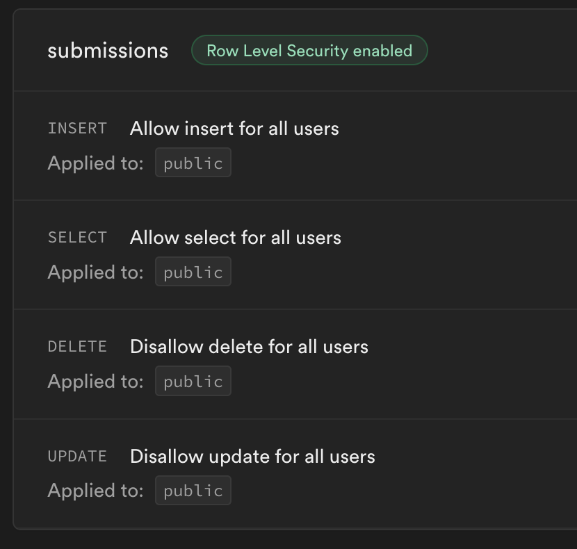
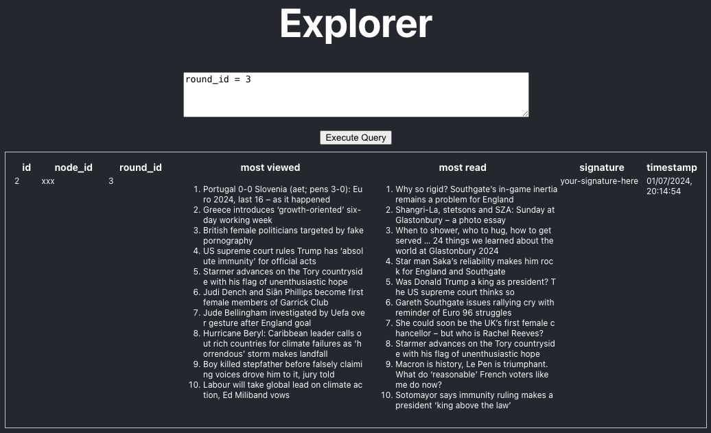
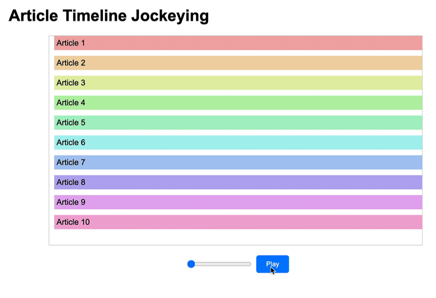

# crawl + store + visualise

The purpose of this repo is to **crawl + store + visualise** the result of a Koii task.

Balancing act:
- features
- appealing look
- meta: appealing look being a feature

Ability to see the results of the task = useful.

Ability to combine the results over time and see it on a timeline = useful

_(this is contrary to manually digging into the block explorer to see the results of a task)_

### Requirements

Supabase: https://supabase.com/

**TODO:** Export database schema with associated permissions _(append only, publicly viewable)_



**RELATED**: [question on Slack](https://koii-workspace.slack.com/archives/C06RE53NNKC/p1720075748981719) about best practices of storing historical data _(from previous rounds)_ for the ease of retrieval and visualising.

### 1️⃣ How to run the explorer

* `git clone git@github.com:marsrobertson/koii-crawler-supabase-storage-visualisation.git`
* `npm install`
* `npm start`



### 2️⃣ How to run the crawler

* `cd ADDONS`
* `node crawler`

It should open the automated Chromium to scrape https://www.theguardian.com/uk for the list of trending articles.

### 3️⃣ How to run the visualisation

**NOTE:** currently the visualisation is using the dummy data, it is not plugged in to the database.

Just open `ADDONS/jockeying.html` in the web browser:



### Known issues

The explorer text area does not have robust error handling (not a priority). It simply expects a query like `round_id = 3` that uses spaces as a separator between the parts:

```
const filterConditions = query.split(' ').filter(Boolean);
const column = filterConditions[i];
const operator = filterConditions[i + 1];
const value = filterConditions[i + 2];
```

------
Default readme from `npx create-react-app` starts here
------


# Getting Started with Create React App

This project was bootstrapped with [Create React App](https://github.com/facebook/create-react-app).

## Available Scripts

In the project directory, you can run:

### `npm start`

Runs the app in the development mode.\
Open [http://localhost:3000](http://localhost:3000) to view it in your browser.

The page will reload when you make changes.\
You may also see any lint errors in the console.

### `npm test`

Launches the test runner in the interactive watch mode.\
See the section about [running tests](https://facebook.github.io/create-react-app/docs/running-tests) for more information.

### `npm run build`

Builds the app for production to the `build` folder.\
It correctly bundles React in production mode and optimizes the build for the best performance.

The build is minified and the filenames include the hashes.\
Your app is ready to be deployed!

See the section about [deployment](https://facebook.github.io/create-react-app/docs/deployment) for more information.

### `npm run eject`

**Note: this is a one-way operation. Once you `eject`, you can't go back!**

If you aren't satisfied with the build tool and configuration choices, you can `eject` at any time. This command will remove the single build dependency from your project.

Instead, it will copy all the configuration files and the transitive dependencies (webpack, Babel, ESLint, etc) right into your project so you have full control over them. All of the commands except `eject` will still work, but they will point to the copied scripts so you can tweak them. At this point you're on your own.

You don't have to ever use `eject`. The curated feature set is suitable for small and middle deployments, and you shouldn't feel obligated to use this feature. However we understand that this tool wouldn't be useful if you couldn't customize it when you are ready for it.

## Learn More

You can learn more in the [Create React App documentation](https://facebook.github.io/create-react-app/docs/getting-started).

To learn React, check out the [React documentation](https://reactjs.org/).

### Code Splitting

This section has moved here: [https://facebook.github.io/create-react-app/docs/code-splitting](https://facebook.github.io/create-react-app/docs/code-splitting)

### Analyzing the Bundle Size

This section has moved here: [https://facebook.github.io/create-react-app/docs/analyzing-the-bundle-size](https://facebook.github.io/create-react-app/docs/analyzing-the-bundle-size)

### Making a Progressive Web App

This section has moved here: [https://facebook.github.io/create-react-app/docs/making-a-progressive-web-app](https://facebook.github.io/create-react-app/docs/making-a-progressive-web-app)

### Advanced Configuration

This section has moved here: [https://facebook.github.io/create-react-app/docs/advanced-configuration](https://facebook.github.io/create-react-app/docs/advanced-configuration)

### Deployment

This section has moved here: [https://facebook.github.io/create-react-app/docs/deployment](https://facebook.github.io/create-react-app/docs/deployment)

### `npm run build` fails to minify

This section has moved here: [https://facebook.github.io/create-react-app/docs/troubleshooting#npm-run-build-fails-to-minify](https://facebook.github.io/create-react-app/docs/troubleshooting#npm-run-build-fails-to-minify)
